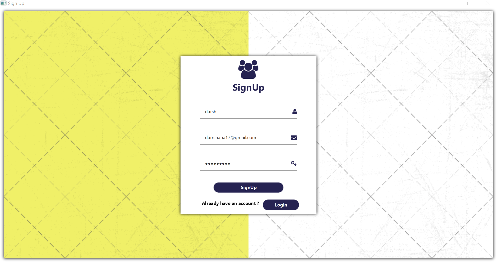
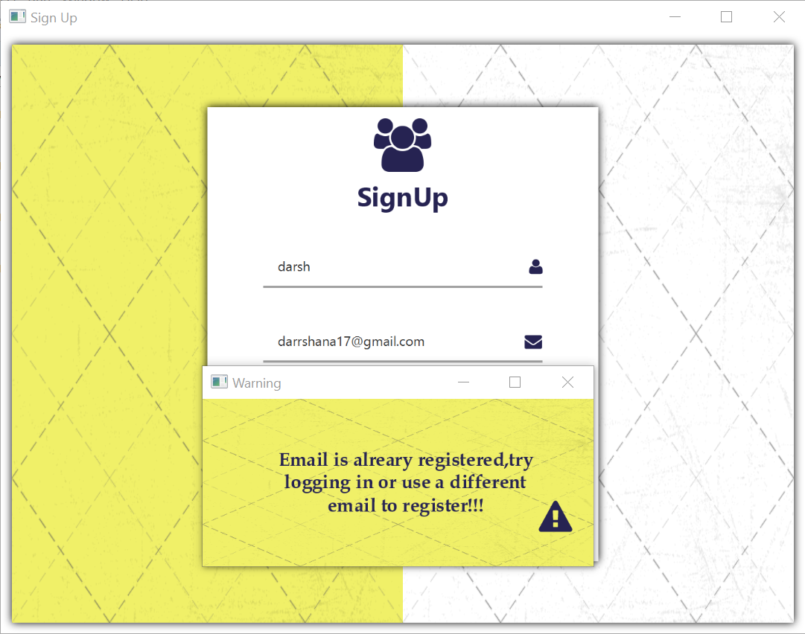
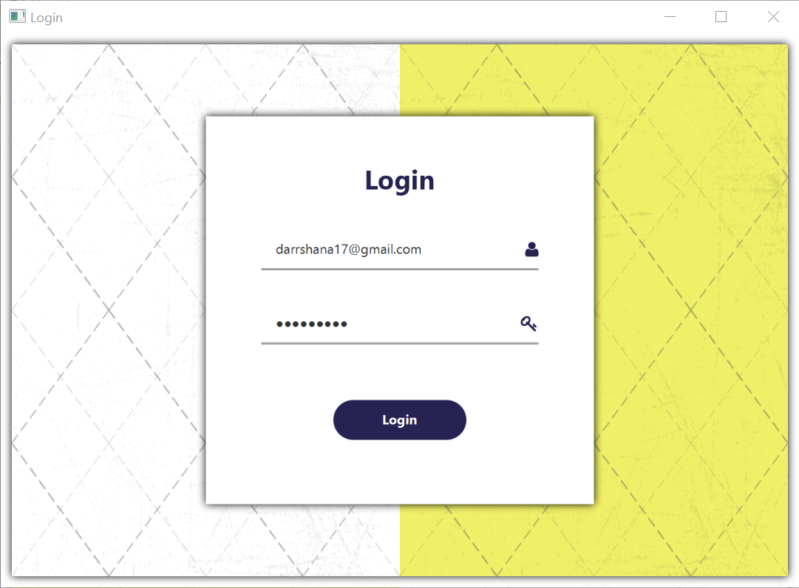
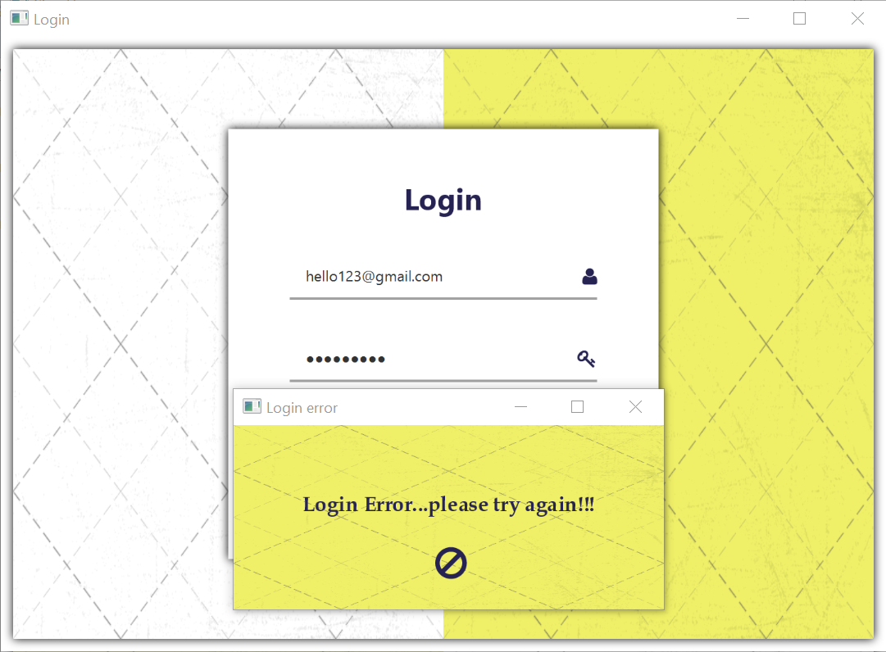
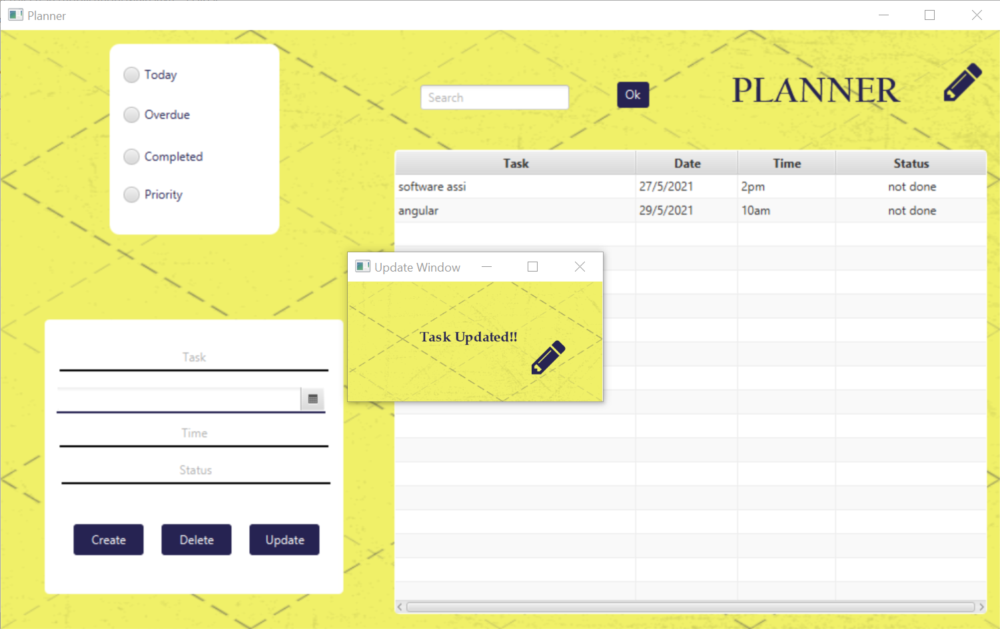
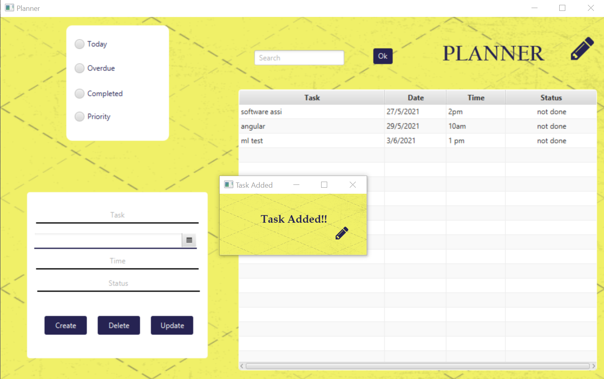
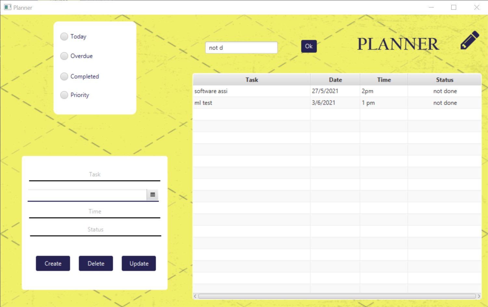
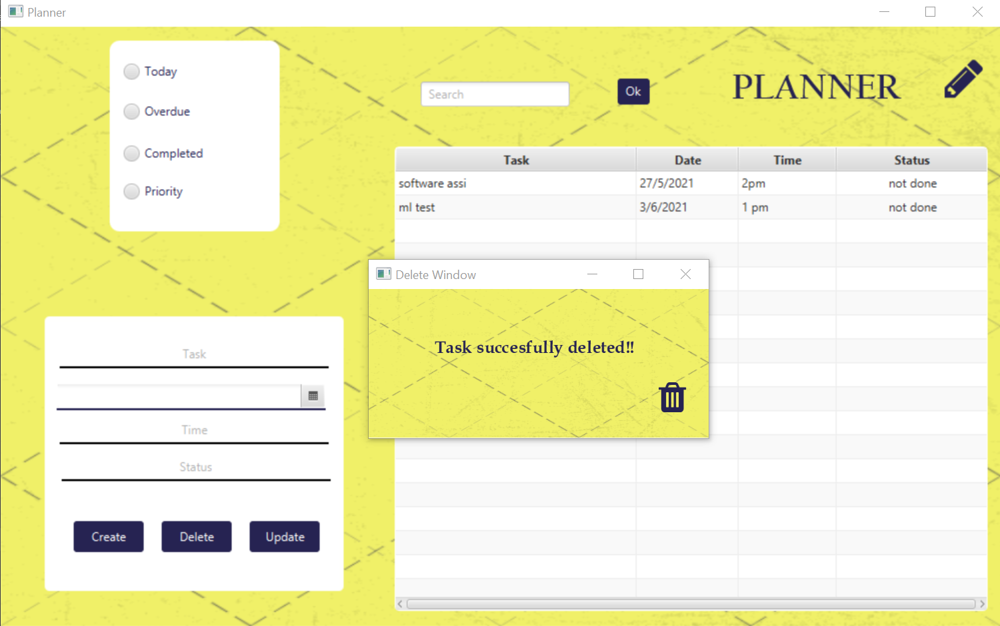

# daily-planner--java-project
A Daily Planner App using JavaFx and JDBC that lets you to add,update,delete,view tasks and also lets you to date-wise and completion status-wise check your tasks.Sign Up and Login functionalities are also added to ensure privacy.

Database Used:MySql Database

JavaFx Scene Builder is used to create the UI.

### Screenshots:

